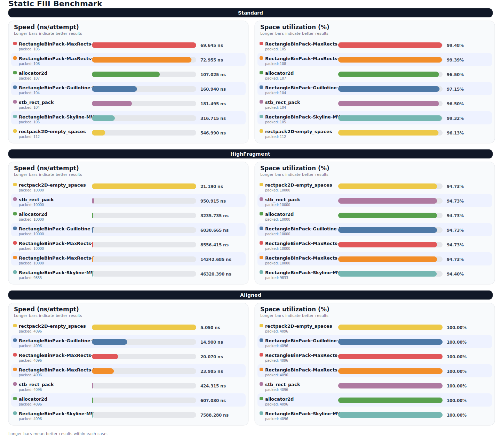
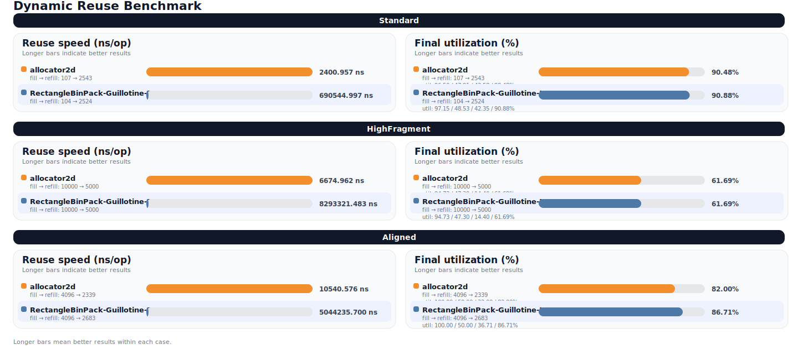
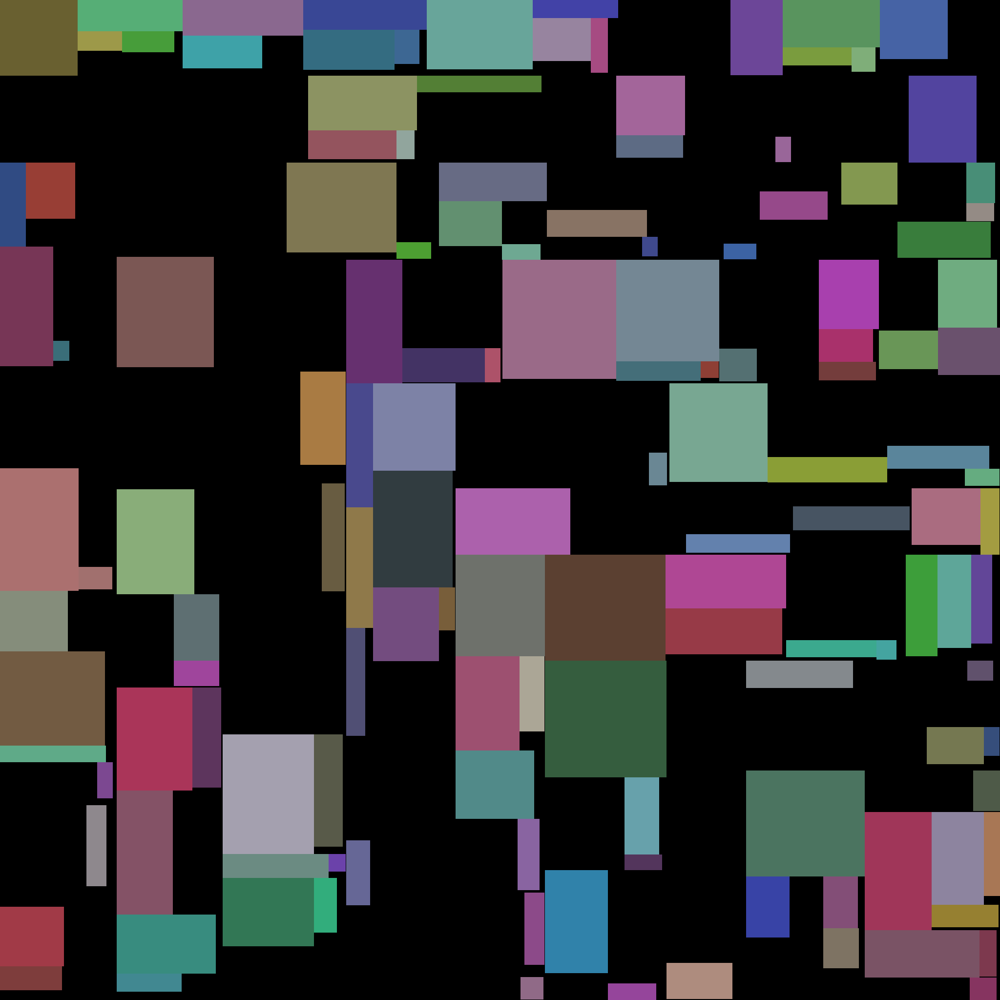

# Allocator 2D
This library is a dynamic 2D rectangle allocator intended for atlas-like workloads that need both allocation and deallocation, such as temporary icons, glyphs, or other reusable subregions.

* Dynamic rectangle allocation and deallocation.
* Single-header and module-friendly interface.
* Supports custom allocators for internal containers and nested body allocators.
* Not thread-safe.
* Never rotates allocated regions.
* Never moves a region after allocation.
* Does not provide a strong exception guarantee.
* Public headers are under `include/mo_yanxi/`.

### Code Sample:
```c++
void foo(){
    mo_yanxi::allocator2d<> a{{256, 256}};
    const unsigned width = 32;
    const unsigned height = 64;
    if(const std::optional<mo_yanxi::math::usize2> where = a.allocate({width, height})){
        // Do something here...

        a.deallocate(where.value());
    }
}
```

## Visual Samples
1. Standard random workload.
2. High-fragmentation small-rectangle workload.
3. Fully aligned 16x16 workload.
* Performance benchmarks are provided by `Google Benchmark` in `benchmarks/allocator2d_benchmark.cpp`
* Cross-library benchmark results and charts are provided in `profile/benchmark/CROSS_LIBRARY_RESULTS.md`
* Validation tests are provided by `GoogleTest` in `tests/allocator2d_test.cpp`
* Runnable visual sample code is kept in `examples/run_sample.cpp`
* Generated sample images are written to `readme_assets/`
* Local profiling and benchmark artifacts are organized under `profile/`

## Cross-Library Benchmark

The benchmark compares `allocator2d` against a small set of C/C++ rectangle packers using the same three workloads.

<p align="center">
  
</p>

<p align="center">
  
</p>

Full numbers and raw CSV output are in `profile/benchmark/CROSS_LIBRARY_RESULTS.md` and `profile/benchmark/data/cross_library_results.csv`.

### Build And Run
```powershell
cmake -S . -B build
cmake --build build --target allocator2d allocator2d_tests allocator2d_benchmark --config Debug
ctest --test-dir build -C Debug --output-on-failure
build\Debug\allocator2d_benchmark.exe
```

```powershell
cmake -S . -B build-visual -DENABLE_TEST=ON
cmake --build build-visual --target allocator2d --config Debug
build-visual\Debug\allocator2d.exe
```

<table width="100%" cellpadding="6" cellspacing="0">
    <thead>
        <tr>
            <th align="center">Test Case</th>
            <th align="center">Initial Allocate</th>
            <th align="center">Partial Deallocate</th>
            <th align="center">Refill After Fragmentation</th>
        </tr>
    </thead>
    <tbody>
        <tr>
            <td align="center"><strong>Standard</strong></td>
            <td align="center" valign="top" width="33%"></td>
            <td align="center" valign="top" width="33%"></td>
            <td align="center" valign="top" width="33%"></td>
        </tr>
        <tr>
            <td align="center"><strong>HighFragment</strong></td>
            <td align="center" valign="top" width="33%"></td>
            <td align="center" valign="top" width="33%"></td>
            <td align="center" valign="top" width="33%"></td>
        </tr>
        <tr>
            <td align="center"><strong>Aligned</strong></td>
            <td align="center" valign="top" width="33%"></td>
            <td align="center" valign="top" width="33%"></td>
            <td align="center" valign="top" width="33%"></td>
        </tr>
    </tbody>
</table>

---

The visual sample currently runs six phases per case: initial fill, first fragmentation, first refill, second fragmentation, second refill, and final full reclamation check. The table above shows the first three image-producing stages.


## Strategy (2-Split)
* Prefer tighter-fitting free regions.
* Track reusable free fragments after partial deallocation.
* Split a region into two subregions when there is remaining space.
* A deallocated region that cannot yet be fully merged can still remain reusable through nested/body allocation.

#### If you want better packing efficiency, allocate larger components first.

## Interface

### Allocate
* Input the extent you need.
* Returns the bottom-left point of the allocated region, or `nullopt` if no suitable space is available.
* The allocated area is never moved.

### Deallocate
* Input the position returned by `allocate`.
* Returns `false` if the point does not identify a currently allocated root in this allocator. In normal usage this should be treated as a logic error, similar to a double-free.

### Copy Constructor/Assign Operator
* Copy construction and copy assignment are protected.


### Move Constructor/Assign Operator
* After move, the source allocator is left in a moved-from state and should not be relied on without reassignment.


## Leak Check
* `mo_yanxi::allocator2d_checked` performs a leak check on destruction.
* If `remain_area()` does not equal the total extent area, it invokes `MO_YANXI_ALLOCATOR_2D_LEAK_BEHAVIOR(*this)` when provided; otherwise it prints an error and calls `std::terminate()`.

## Misc
* Macro `MO_YANXI_ALLOCATOR_2D_USE_STD_MODULE` switches the header to use `import std;`.
* Macro `MO_YANXI_ALLOCATOR_2D_HAS_MATH_VECTOR2` allows reusing an external `mo_yanxi::math::vector2` implementation.


